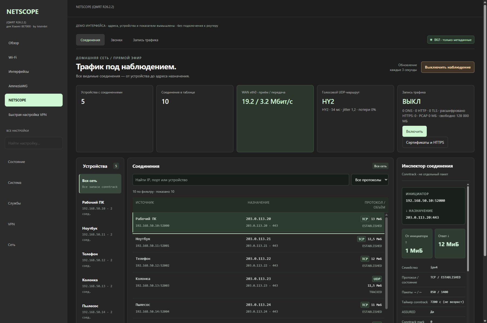
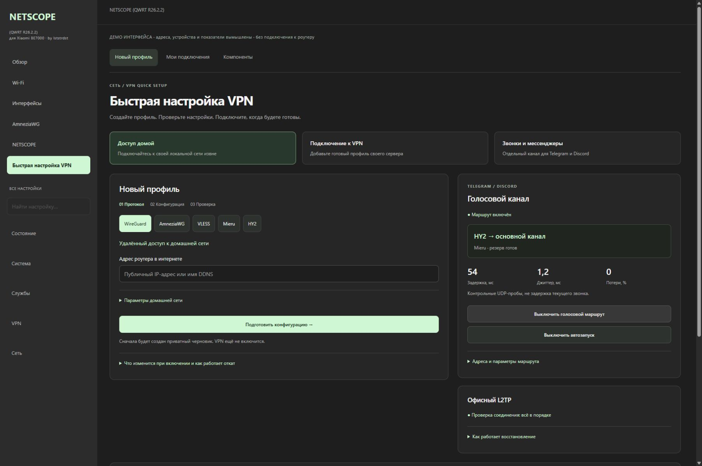

# NETSCOPE

**A home firmware project for Xiaomi BE7000, based on QWRT**

[Русский](README.md) | **English**

[](https://github.com/lststrdst/netscope-firmware/actions/workflows/tests.yml)

I develop NETSCOPE as a coherent software layer for my Xiaomi BE7000 (RC06):
a Russian LuCI web UI, network visibility, guarded VPN setup, recovery, IoT
diagnostics and a separate Wi‑Fi 7/MLO lab.

The current base is QWRT R26.02.02 / QSDK 12.5. NETSCOPE keeps the origin
visible as `Based on QWRT` and preserves upstream authorship and licensing. It
is not an official QWRT, Xiaomi, Qualcomm or OpenWrt project.

> NETSCOPE 0.7-dev is released as a verifiable installable overlay for the exact
> QWRT R26.2.2 base. It installs the UI and services on a running router, creates
> a rollback backup and never writes NAND/UBI. It is not yet a factory or
> sysupgrade image because the matching complete QWRT source/toolchain is not public.

## Interface preview

Current production views rendered locally with **synthetic data**, not private
home traffic or live VPN credentials. [Gallery and reproduction](docs/SCREENSHOTS.md).





[Implemented features and remaining work](docs/ROADMAP.md).

## Why I am building it

The BE7000 is my primary home gateway. It carries direct internet traffic,
remote access, IoT devices, selective routing and an office tunnel. I want a
maintainable product instead of a collection of one-off shell commands:

- one interface for current network state;
- guarded setup for WireGuard, AmneziaWG, VLESS/Xray, Mieru and Hysteria 2;
- preflight, isolated scope and rollback for every network mutation;
- explicit PCAP/session storage that does not fill internal flash;
- a stable IoT segment with controlled access from the main LAN;
- Wi‑Fi 7 experiments that cannot silently enter the boot path;
- a documented return to a known-good state.

## NETSCOPE components

| Component | Purpose | Current status |
|---|---|---|
| NETSCOPE UI | Russian LuCI shell, login, navigation and base version | published as `luci-theme-netscope`; runs on the test router |
| NETSCOPE Traffic | devices, conntrack, directions, ports, counters and controlled USB PCAP sessions | published as `luci-app-netscope`; Capture stays OFF after installation |
| VPN Quick setup | prepare and explicitly activate WG, AWG, VLESS/Xray, Mieru and HY2 from LuCI | each protocol has preflight, confirmation, health checks and isolated rollback; Telegram/Discord UDP can be routed through HY2 with opt-in boot recovery and fail-open |
| Voice health | current Telegram/Discord endpoints, selected route, probe latency, jitter, loss and bounded history | local metadata only; call payload is never recorded |
| L2TP watchdog | PPP, office routes, MTU/MSS and scoped reconnect checks | public service ships disabled; private probes, prefixes and credentials stay on the router |
| IoT monitor | distinguish Wi‑Fi, DHCP, DNS, WAN and cloud failures | read-only tool published |
| Recovery | backups, known-good baseline and return procedure | runbook published; no recovery image is distributed |
| Wi‑Fi 7 / MLO Lab | investigate the vendor 5G-low + 5G-high topology | models, render-only helper and tests only; no live apply |

Status labels are literal: **works** means tested on my router, **published**
means the source is present here, **model** does not prove hardware behavior,
and **plan** means the runtime is not released.

## Why IoT is separate

A voice speaker intermittently reported that it had no internet while the
router WAN remained alive. A vacuum was later added to the same diagnostic
segment. These clients therefore use a dedicated 2.4 GHz network, with only
the required local control allowed from the main LAN.

The Xiaomi firmware supports Wi‑Fi 7/MLO, but its supported configuration does
not keep both 5 GHz radio links in one MLD while exposing 2.4 GHz as a separate
IoT SSID. The stock UI therefore makes the user choose between the unified MLO
network and band separation that loses the desired MLO topology. This
constraint—not a lack of Wi‑Fi 7 on stock—is why NETSCOPE treats IoT as a
separate design problem.

MLO is not presented as the proven root cause. Band steering, the client,
DHCP/DNS or the cloud service remain possible. The
[IoT monitor](tools/netscope-iot-monitor) collects evidence; the sanitized
network design is in [docs/IOT-NETWORK.md](docs/IOT-NETWORK.md).

## Wi‑Fi 7 / MLO boundary

The Xiaomi firmware can expose the external QCN9224 as two 5 GHz PHYs and join
them into an MLD. The current QWRT boot uses single-PHY mode. Reproducing the
vendor topology requires a coherent GPIO, BDF, ART offset, CNSS startup order
and MLO configuration.

The repository contains an UART-gated hardware transaction model and a
theoretical no-UART trial model. The latter only accepts post-boot RAM state:
no UCI commit, autostart, boot files, boot environment, MTD or ART writes. Both
models emit zero router commands and always report `live_apply_allowed=false`.
A kernel hang is explicitly classified as requiring a local power cycle.

See [docs/WIFI7-MLO.md](docs/WIFI7-MLO.md) for the topology, failure matrix and
future hardware acceptance gates. The UI concept is available
[in Figma](https://www.figma.com/design/SlXSi90WevQOkB78HuLdFp?node-id=56-318).

## Repository layout

```text
firmware/
  overlay/                            guarded installer for QWRT R26.2.2
  packages/luci-app-netscope/         Traffic, PCAP and optional HTTPS lab
  packages/luci-theme-netscope/       Russian LuCI shell
  packages/luci-app-netscope-setup/   LuCI VPN Quick setup
  packages/netscope-wifi7-lab/        read-only Wi-Fi 7 preflight/renderer
  profiles/                            target base profile and release gates
src/netscope_firmware/                 offline transaction/recovery models
profiles/                              public board constants
tools/netscope-iot-monitor/            read-only IoT diagnostics
examples/                              sanitized VPN templates
docs/                                  architecture, installation, recovery, labs
tests/                                 product, security and failure-path tests
```

See [the architecture](docs/ARCHITECTURE.md) and the
[current roadmap](docs/ROADMAP.md).

## Run the verification suite

```bash
python -m pip install -e .
python -m unittest discover -s tests -v
python -m netscope_firmware profiles/be7000-rc06-qwrt-r26.02.02.json
python tools/check_public.py
```

CI runs the suite on Python 3.10, 3.12 and 3.13 and validates public JavaScript
and shell files. These checks prove code properties and recovery paths; they
do not emulate QCN9224 RF, PCIe power sequencing, EHT beacons or a real client
multi-link association.

## Release boundary

The public overlay is built solely from this repository with
`python tools/build_overlay.py`; see [the install guide](docs/INSTALL-OVERLAY.md).
The first flashable image still requires a pinned build base and toolchain, verified NAND/UBI
layout, clean first boot, a backup slot, power-loss tests and a proven return
to a known-good image. `sysupgrade -F`, ART writes and calibration data copied
from another router are not acceptable shortcuts.

Live credentials, VPN subscriptions, private keys, device MAC addresses,
backups, ART, EEPROM and vendor firmware blobs are excluded from Git. The MIT
license only covers original NETSCOPE code and documentation.

## Links

- [Architecture](docs/ARCHITECTURE.md)
- [Status and roadmap](docs/ROADMAP.md)
- [Release checklist](firmware/RELEASE-CHECKLIST.md)
- [OpenWrt Xiaomi BE7000 support work](https://github.com/openwrt/openwrt/pull/20604)
- [NETSCOPE repository](https://github.com/lststrdst/netscope-firmware)
